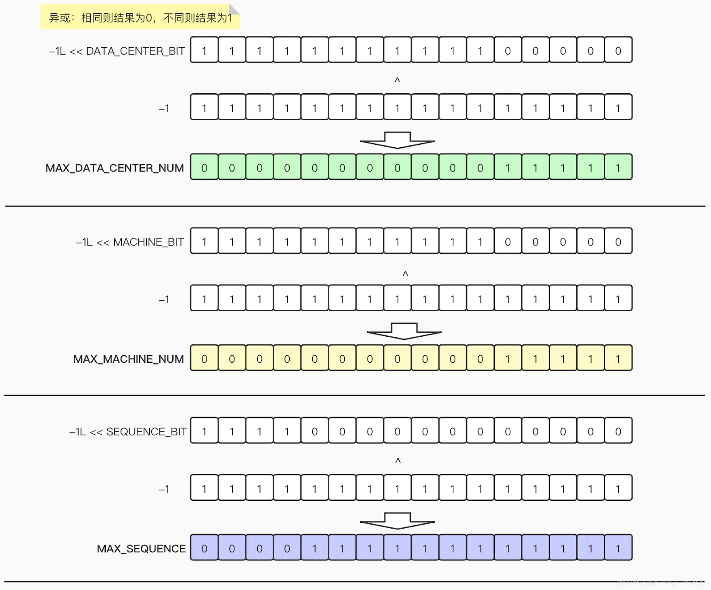

# 雪花算法（snowflake）实现原理图解

snowflake是twitter的分布式环境生成全局唯一id的解决方案

snowflake id组成分析
snowflake-64bit

分别有三部分（其中第一位保留位，暂时没用）：


第一部分：时间戳（毫秒级），这里为41bit
第二部分：工作机器id，一般为==5bit数据中心id（datacenterId）+5bit机器id（workerId）==组成，10位的长度最多支持部署1024个节点
第三部分：在相同毫秒内，可以产生2^12 个id，12位的计数顺序号支持每个节点每毫秒产生4096个ID序列
snowflake-32bit


大致与64bit相同，唯一区别是时间戳部分这里仅占用32bit，因为保存的时间戳为：currStamp - START_STAMP，得出来的数据仅用10bit就可以保存，位数越少，对磁盘、数据索引等数据提高越明显

优点
按照时间自增排序，在多个分布式系统内不会产生id碰撞（数据中心+机器id区分）
高性能：理论上QPS约为409.6w/s（1000*2^12）
不依赖于任何外部第三方系统
灵活性高：可以根据自身业务情况调整分配bit位
缺点
强依赖时钟：生成都是以时间自增，如果时间回拨，可能导致id重复
美团对此缺点做了一些改进，具体可以参考：Leaf——美团点评分布式ID生成系统

源码解析


```java
/**

 * twitter的snowflake算法 -- java实现
   *

 * @author beyond

 * @date 2016/11/26
   */
   public class SnowFlake {

   /**

    * 起始的时间戳 2016-11-26 21:21:05
      */
      private final static long START_STAMP = 1480166465631L;

   /**

    * 每一部分占用的位数
      */
      private final static long SEQUENCE_BIT = 12; //序列号占用的位数
      private final static long MACHINE_BIT = 5;   //机器标识占用的位数
      private final static long DATA_CENTER_BIT = 5;//数据中心占用的位数

   /**

    * 每一部分的最大值
      */
      private final static long MAX_DATA_CENTER_NUM = -1L ^ (-1L << DATA_CENTER_BIT);
      private final static long MAX_MACHINE_NUM = -1L ^ (-1L << MACHINE_BIT);
      private final static long MAX_SEQUENCE = -1L ^ (-1L << SEQUENCE_BIT);

   /**

    * 每一部分向左的位移
      */
      private final static long MACHINE_LEFT = SEQUENCE_BIT;
      private final static long DATA_CENTER_LEFT = SEQUENCE_BIT + MACHINE_BIT;
      private final static long TIMESTAMP_LEFT = DATA_CENTER_LEFT + DATA_CENTER_BIT;

   private long dataCenterId;  //数据中心
   private long machineId;     //机器标识
   private long sequence = 0L; //序列号
   private long lastStamp = -1L;//上一次时间戳

   public SnowFlake(long dataCenterId, long machineId) {
       if (dataCenterId > MAX_DATA_CENTER_NUM || dataCenterId < 0) {
           throw new IllegalArgumentException("dataCenterId can't be greater than MAX_DATA_CENTER_NUM or less than 0");
       }
       if (machineId > MAX_MACHINE_NUM || machineId < 0) {
           throw new IllegalArgumentException("machineId can't be greater than MAX_MACHINE_NUM or less than 0");
       }
       this.dataCenterId = dataCenterId;
       this.machineId = machineId;
   }

   /**

    * 产生下一个ID
      *

    * @return
      */
      public synchronized long nextId() {
      // 获得当前时间的毫秒数
      long currStamp = getNewStamp();
      if (currStamp < lastStamp) {
          throw new RuntimeException("Clock moved backwards.  Refusing to generate id");
      }

      if (currStamp == lastStamp) {
          // 相同毫秒内，序列号自增
          sequence = (sequence + 1) & MAX_SEQUENCE; // 为了保证取值范围最大为MAX_SEQUENCE
          // 同一毫秒的序列数已经达到最大
          if (sequence == 0L) { // 即：已经超出MAX_SEQUENCE 即：1000000000000
              currStamp = getNextMill();
          }
      } else {
          //不同毫秒内，序列号置为0
          sequence = 0L;
      }

      lastStamp = currStamp;

      return (currStamp - START_STAMP) << TIMESTAMP_LEFT // 时间戳部分
              | dataCenterId << DATA_CENTER_LEFT       // 数据中心部分
              | machineId << MACHINE_LEFT             // 机器标识部分
              | sequence;                             // 序列号部分
      }

   /**

    * 获得下一个毫秒数，比lastStamp大的下一个毫秒数
      *
    * @return
      */
      private long getNextMill() {
      long mill = getNewStamp();
      while (mill <= lastStamp) {
          mill = getNewStamp();
      }
      return mill;
      }

   /**

    * 获得当前毫秒数
      *
    * @return
      */
      private long getNewStamp() {
      return System.currentTimeMillis();
      }
      
public static void main(String[] args) {
    SnowFlake snowFlake = new SnowFlake(3L, 10L);
    System.out.println("snowFlake.nextId() = " + snowFlake.nextId());
}
}
```

其中有对三个部分都限制了最大值（MAX_DATA_CENTER_NUM、MAX_MACHINE_NUM、MAX_SEQUENCE），我们通过图解的方式来看下计算过程：




总结
其它还有利用数据库来生成分布式全局唯一ID方案，不过性能与稳定性都不如snowflake，针对snowflake比较成熟的解决方案可以参考
Leaf——美团点评分布式ID生成系统，此方案综合考虑到了高可用、容灾、分布式下时钟等问题。

参考
https://blog.csdn.net/fly910905/article/details/82054196
https://github.com/beyondfengyu/SnowFlake/blob/master/SnowFlake.java
------------------------------------------------
